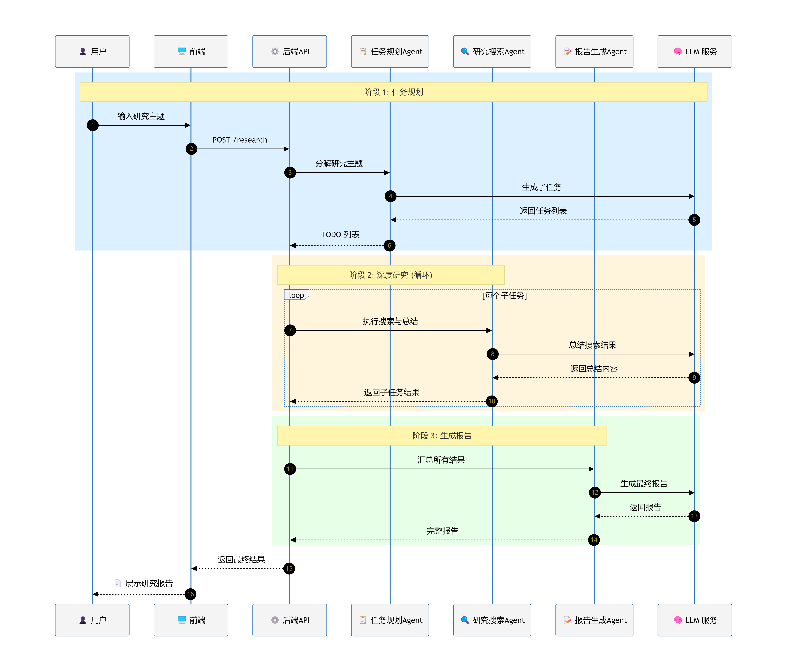
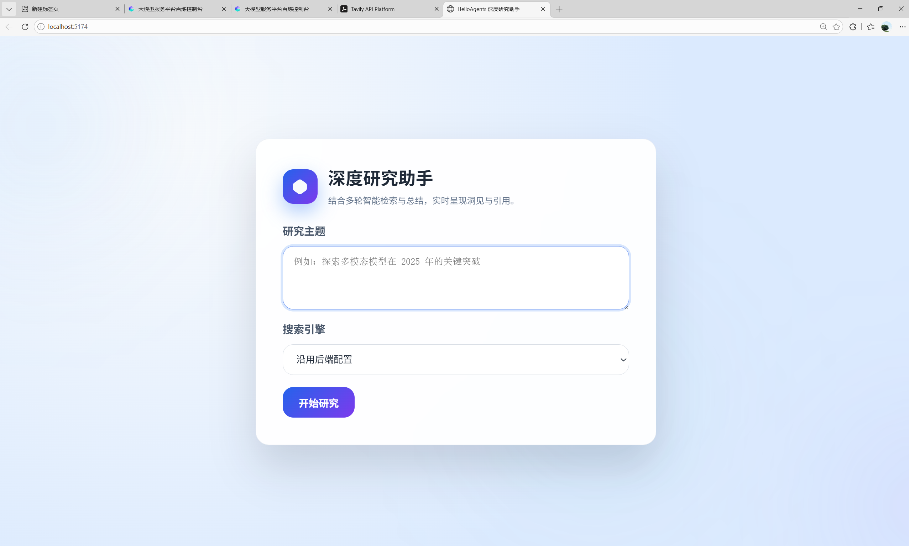
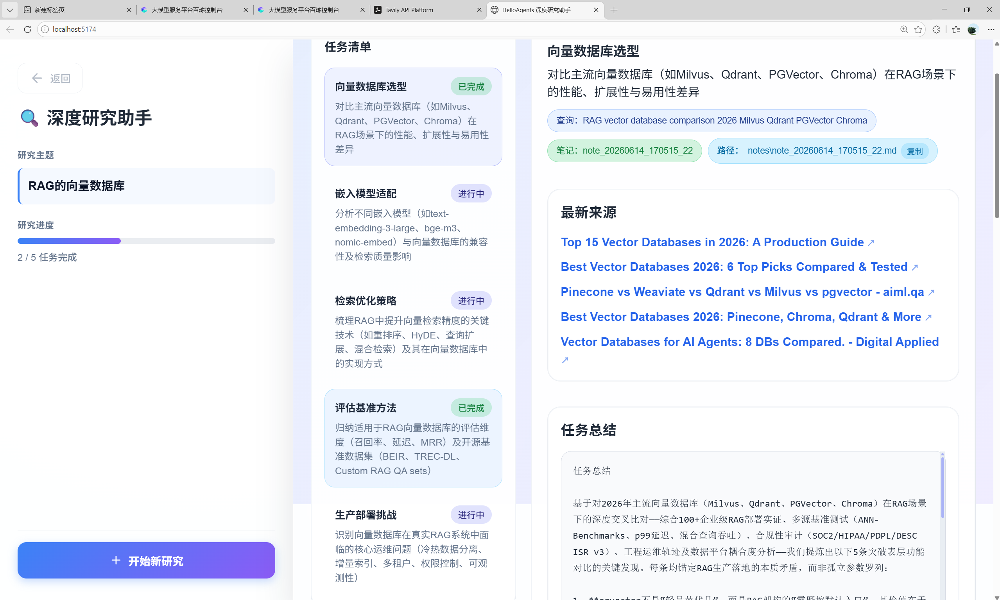
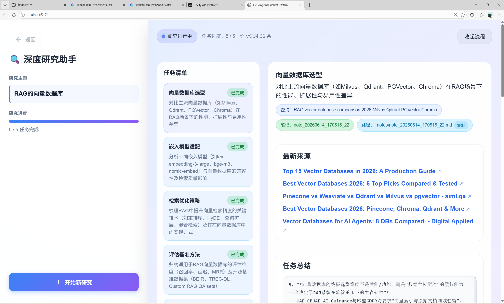

# Deep Researcher

基于 HelloAgents 框架的深度网络研究助手，能够自动规划研究任务、搜索网络信息、生成结构化研究报告。

## 项目简介

HelloAgents Deep Researcher 是一个智能研究助手，它可以帮助用户：

- **节省时间**  ：将 1-2 小时的研究工作压缩到 5-10 分钟
- **高质量**  ：系统化的研究流程，避免遗漏重要信息
- **可追溯**  ：记录所有搜索结果和来源，方便验证和引用

## 技术栈

### 后端

| 技术 | 版本 | 说明 |
|------|------|------|
| Python | >= 3.10 | 核心运行环境 |
| FastAPI | >= 0.115.0 | Web API 框架 |
| HelloAgents | 0.2.9 | Agent 框架，提供 LLM 集成和工具调用能力 |
| OpenAI SDK | >= 1.12.0 | OpenAI 兼容 API 客户端 |
| Uvicorn | >= 0.32.0 | ASGI 服务器 |
| Tavily | >= 0.5.0 | 网络搜索 API |
| DuckDuckGo Search | >= 9.6.1 | 免费搜索后端 |
| Loguru | >= 0.7.3 | 日志库 |
| python-dotenv | 1.0.1 | 环境变量管理 |

### 前端

| 技术 | 版本 | 说明 |
|------|------|------|
| Vue 3 | 5.13 | 前端框架 |
| TypeScript | 5.7.3 | 类型安全 |
| Vite | 6.0.7 | 构建工具 |
| Axios | 1.7.9 | HTTP 客户端 |

## 项目架构

```
helloagents-deepresearch/
├── backend/                    # 后端服务
│   ├── src/
│   │   ├── main.py            # FastAPI 入口，API 路由定义
│   │   ├── agent.py           # DeepResearchAgent 核心协调器
│   │   ├── config.py          # 配置管理，环境变量加载
│   │   ├── models.py          # 数据模型定义
│   │   ├── prompts.py         # LLM 提示词模板
│   │   ├── utils.py           # 工具函数
│   │   └── services/          # 业务服务层
│   │       ├── planner.py     # 任务规划服务
│   │       ├── search.py      # 搜索服务（Tavily/DuckDuckGo）
│   │       ├── summarizer.py  # 内容总结服务
│   │       ├── reporter.py    # 报告生成服务
│   │       ├── notes.py       # 笔记工具服务
│   │       └── tool_events.py # 工具调用事件追踪
│   ├── .env                   # 环境配置文件
│   └── pyproject.toml         # Python 项目配置
│
├── frontend/                   # 前端应用
│   ├── src/
│   │   ├── App.vue            # 主应用组件
│   │   ├── main.ts            # 入口文件
│   │   ├── services/
│   │   │   └ api.ts           # API 调用封装
│   │   └── style.css          # 样式文件
│   ├── package.json           # Node.js 项目配置
│   └── vite.config.ts         # Vite 配置
│
└── README.md                   # 项目文档
```

### 核心流程



1. **任务规划** - 用户输入研究主题，LLM 自动生成 TODO 任务清单
2. **并行搜索** - 多个任务并行执行，调用搜索 API 获取信息
3. **内容总结** - 对搜索结果进行智能总结提取关键信息
4. **报告生成** - 整合所有任务结果，生成结构化研究报告

### 运行展示





## 使用指南

### 环境要求

- Python >= 3.10
- Node.js >= 16.x
- npm >= 8.x

### 快速启动

#### 1. 配置环境变量

编辑 `.env` 文件，配置以下关键参数：

```env
# LLM 配置
LLM_PROVIDER=custom              # 使用自定义 API
LLM_MODEL_ID=qwen-plus           # 模型名称
LLM_API_KEY=your-api-key         # API 密钥
LLM_BASE_URL=https://dashscope.aliyuncs.com/compatible-mode/v1  # API 地址

# 搜索服务配置
SEARCH_API=tavily                # 搜索后端：tavily
TAVILY_API_KEY=your-tavily-key   # Tavily API 密钥
```

#### 2. 启动后端

```bash
cd backend

# 方式1：使用 uv（推荐）
uv venv .venv
uv sync
python src/main.py

# 方式2：使用 pip
pip install -e .
python src/main.py
```

后端服务将在 http://localhost:8000 启动。

#### 3. 启动前端

```bash
cd frontend

# 安装依赖
npm install

# 启动前端应用
npm run dev
```

前端应用将在 http://localhost:5174 启动。

## 常见问题

### 1. LLM 调用失败

- 检查 `LLM_API_KEY` 是否正确
- 检查 `LLM_MODEL_ID` 是否是有效的模型名称
- 检查 `LLM_BASE_URL` 是否正确

### 2. 搜索失败

- 使用 Tavily 时检查 `TAVILY_API_KEY`
- 使用 DuckDuckGo 时可能遇到限流，稍后重试

### 3. 端口冲突

- 后端默认端口 8000，可通过 `PORT` 环境变量修改
- 前端默认端口 5174，Vite 会自动寻找可用端口

